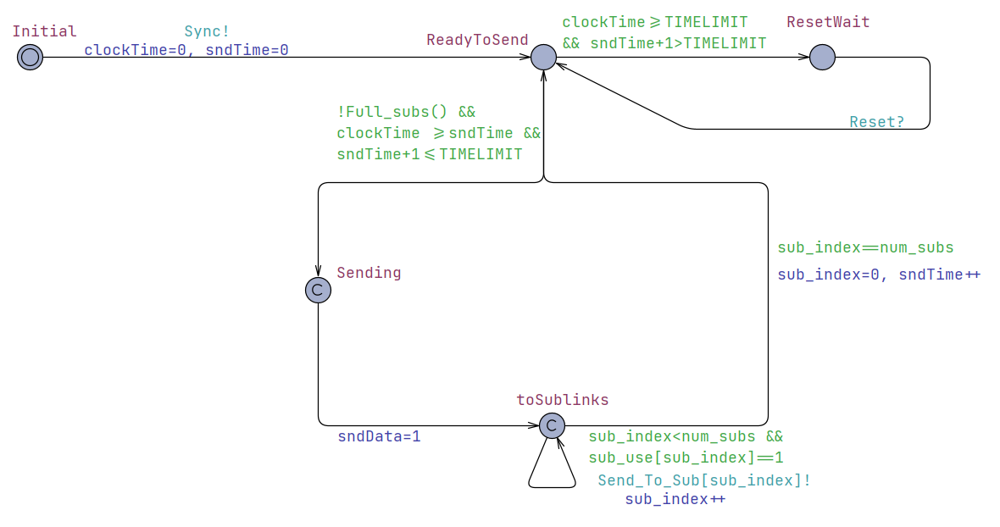
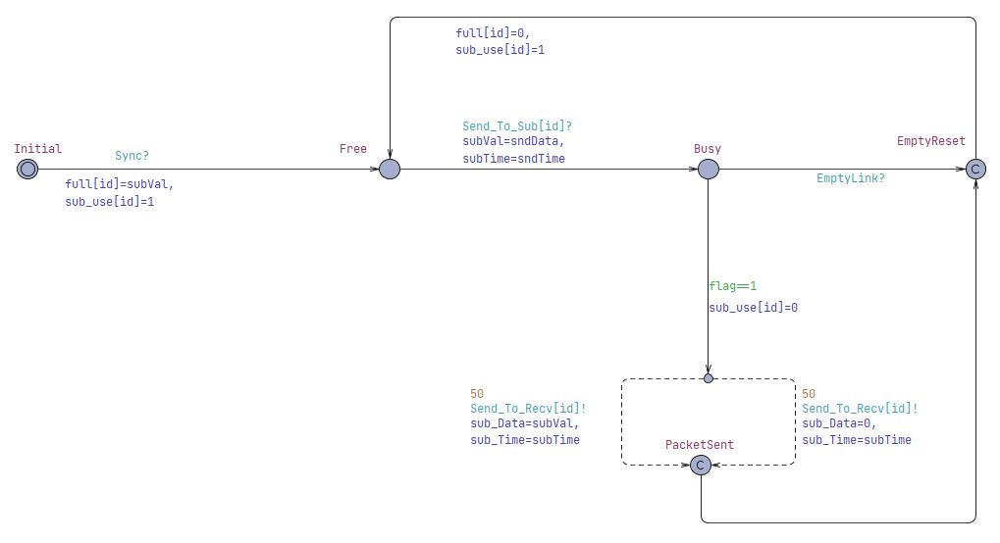
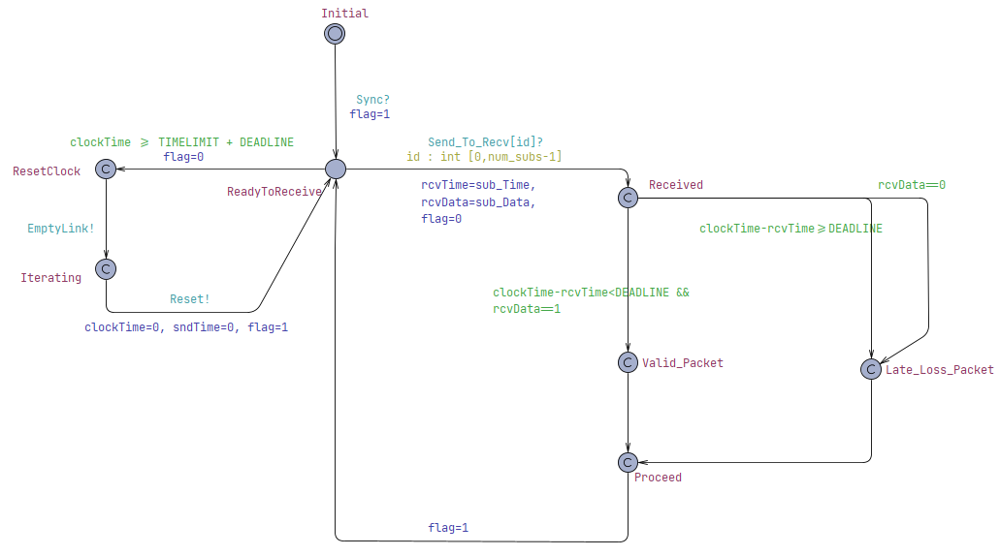
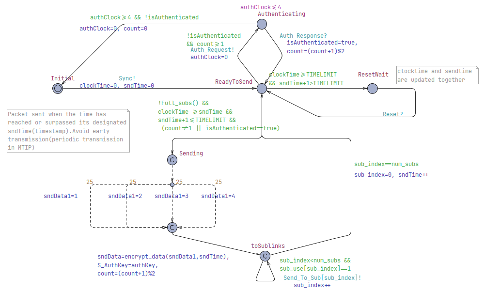
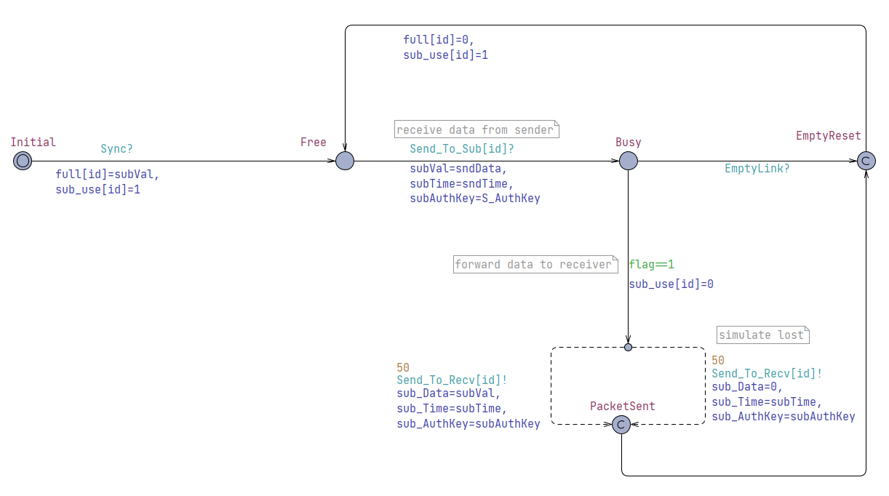
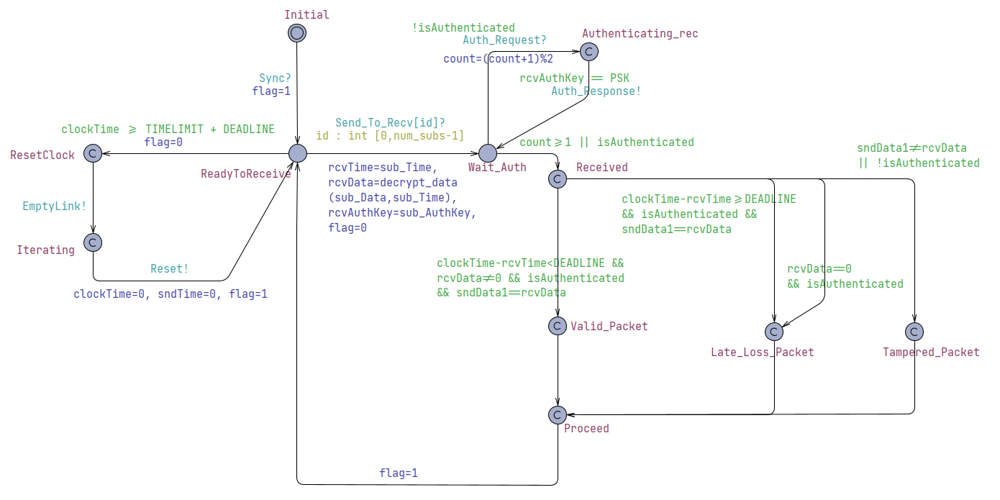
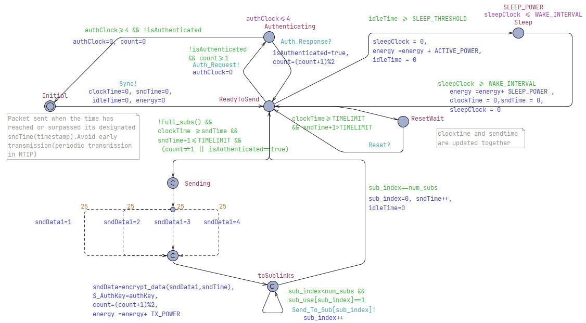
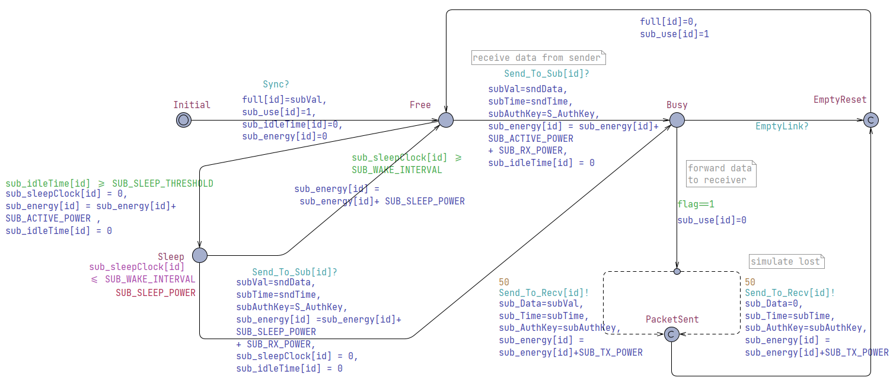
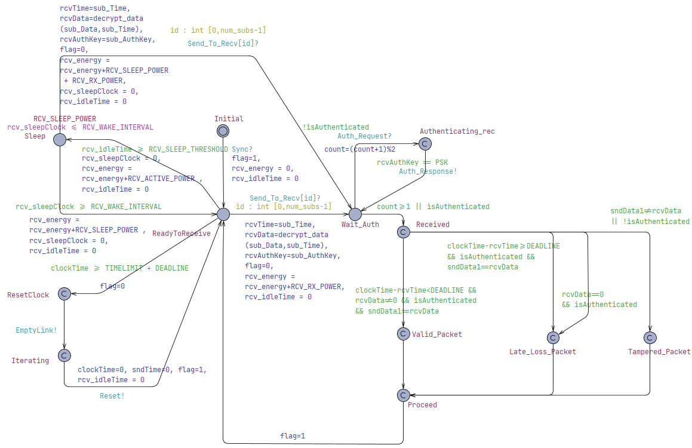

# Enhanced MTIP: Secure and Energy-Efficient Multi-connection Tactile Internet Protocol

This repository contains UPPAAL models, simulation results, and verification proofs for the Multi-connection Tactile Internet Protocol (MTIP) across three phases: basic MTIP, security-enhanced MTIP, and the final energy-efficient, secure MTIP with sleep modes.

## Repository Structure

- `Basic_MTIP.xml` - Original MTIP model (no security or sleep modes)
- `Enhanced_MTIP_Secure.xml` - MTIP with mutual authentication and encryption
- `Enhanced_MTIP_Sleepy_and_Secure.xml` - MTIP with authentication, encryption, and adaptive sleep modes
- `efficiency_proofs/` - Screenshots and data from UPPAAL concrete simulator runs demonstrating energy savings
- `images/` - Automaton diagrams for each MTIP phase and component

---

## 1. Basic MTIP

**Sender Automaton:**  

**Sublink Automaton:**  

**Receiver Automaton:**  

*Implements multi-path transmission for reliability and low latency. No built-in security or energy-saving mechanisms.*

---

## 2. Enhanced MTIP with Security

**Sender Automaton:**  

**Sublink Automaton:**  

**Receiver Automaton:**  

*Adds mutual authentication (PSK-based challenge-response) and lightweight XOR encryption with timestamp binding for confidentiality and integrity. Formally verified for deadlock freedom, authentication, and data integrity.*

---

## 3. Sleepy & Secure Enhanced MTIP

**Sender Automaton:**  

**Sublink Automaton:**  

**Receiver Automaton:**  

*Incorporates adaptive sleep modes in sender, sublink, and receiver. Achieves up to 65% energy savings in simulation while maintaining all security and timing guarantees.*

---

## Energy Efficiency Proofs

The `efficiency_proofs/` folder contains screenshots and data from UPPAAL's concrete simulator, demonstrating energy savings for each component (sender, sublink, receiver) in the enhanced protocol.

---

## How to Use

1. Open the `.xml` files in [UPPAAL](https://uppaal.org/) to explore or simulate the models.
2. Refer to the included automaton images for visual reference.
3. See `efficiency_proofs/` for quantitative results and screenshots.

---

## Citation

If you use this repository or its results in your work, please cite the corresponding thesis or publication.

---

**Contact:**  
For questions or contributions, please open an issue or contact the repository maintainer.
